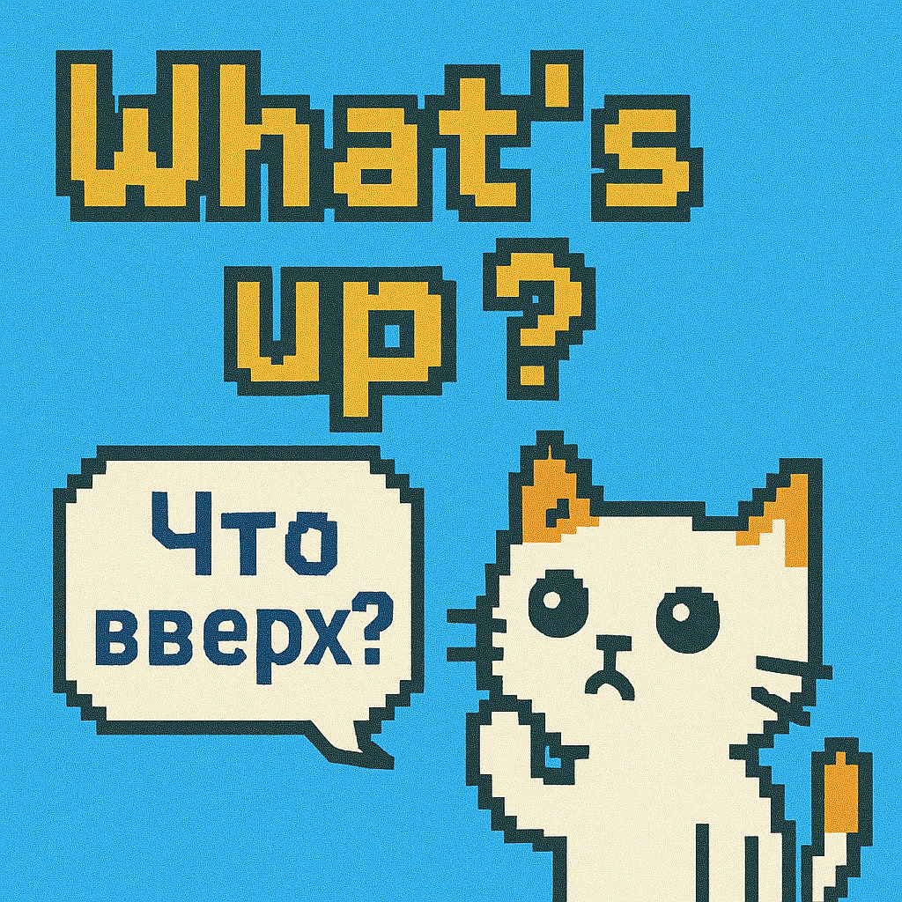

**What’s up? — или как сказать «Как дела?» и не запутаться**

Привет, ребята! Это мой первый пост, и сразу — классика английского: **What’s up?**  

Все слышали, все говорят, но далеко не все понимают, откуда эта фраза взялась и что она значит буквально.  
  
Если перевести дословно — «Что вверх?» или «Что поднято?». Немного странно, правда? Но на самом деле это устоявшееся выражение, которое означает «Как дела?» или «Что нового?».

Почему «вверх»? Представьте, что вы смотрите ленту новостей в соцсетях — сверху всегда самые свежие и важные события. Вот и в выражении **What’s up?** — «up» ассоциируется с чем-то новым, свежим, что «поднялось» наверх.  

А теперь немного личного:  
Я изучаю английский почти два года — почти каждый день, пусть и без фанатизма. За это время накопилось желание делиться своими эмоциями, наблюдениями и языковыми лайфхаками. Кто знает — может, самому будет интересно перечитать это всё спустя время.

Публикую это в [свой Telegram‑канал](https://t.me/LangEngRu) и здесь — смотрю, где будет поживее 😊

Так что — **What’s up?**  
Жду ваших ответов 😊 и любых откликов!
