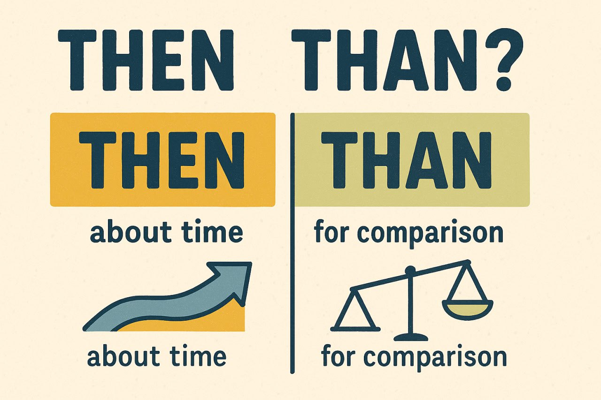

**Then или Than? Да кто их вообще придумал такими похожими?**  
  

Из классики путаницы для изучающих английский — **then** и **than**.  
  
Пишутся похоже. Звучат похоже. А смысл — совсем разный.  
  
🟡 **Then** — это про время. Что-то _потом_, _затем_, _тогда_.  
_We ate, then we danced._ — Мы поели, **а потом** потанцевали.  
  
🟢 **Than** — это сравнение. Типа _чем кто-то/что-то_.  
_Cats are smarter than dogs._ — Кошки умнее, **чем** собаки.  
  
🔍 _Маленькая подсказка (как вариант мнемоники):_  
**Then** — в нём **"e" как в "event"** — значит, дело, событие, последовательность.  
**Than** — в нём **"a" как в "comparison"** (ну почти) — сравнение.  
  
🎭 Стоит перепутать — и логика сдаётся:  
_I’d rather sleep **than** talk._ — Я лучше посплю, **чем** говорить.  
_I’d rather sleep **then** talk._ — Сначала посплю, **а потом** поговорю.  
— Всё ещё разумно. Но подозрительно.

💡 Я не лингвист, но стало интересно — почему **then** и **than** такие похожие? Быстрый поиск подсказал: когда-то в Среднеанглийском это вообще было одно слово — _thanne_ или _þanne_, означающее «тогда». Позже значения разошлись: **then** стало про время, **than** — про сравнение. Так что путаница не случайна, а историческая.
