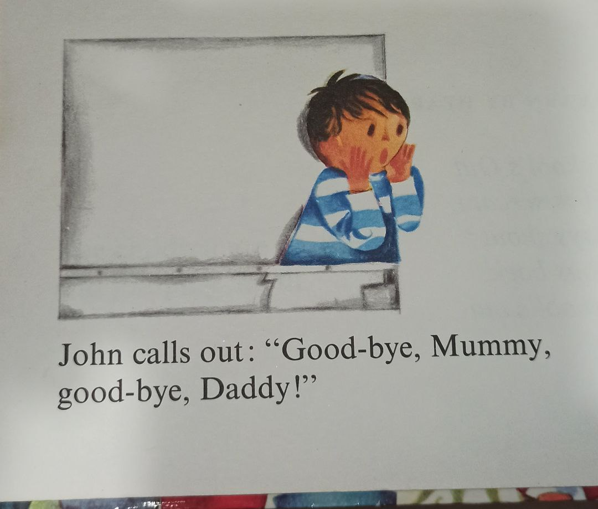
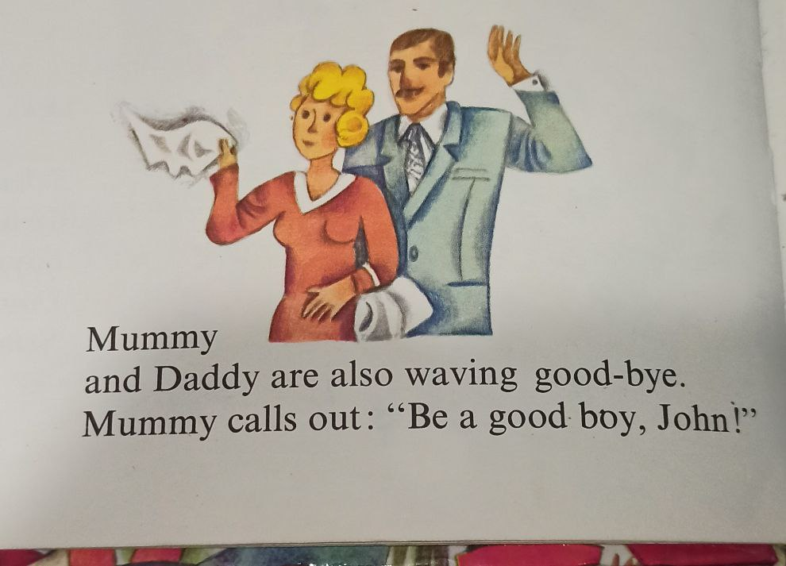

**Заметил, что «Mom» и «Dad» иногда пишут с большой буквы**

...а также _Grandma, Grandpa, Aunt, Uncle_ и некоторые другие. Почему так? Чтобы подчеркнуть уважение? В какой-то момент начинаю сомневаться: может быть их вообще всегда принято писать с большой буквы? Или можно по-разному, как хочется? Или всё же есть определённые правила?

Поиск в интернете дал такое объяснение: в английском некоторые слова из нарицательных существительных вдруг **становиться именами собственными** (по крайней мере, начинает играть похожую роль). Именно это происходит со словами _Mom_, _Dad_ и другими, когда мы имеем в виду **конкретную личность**. Это похоже на то, когда мы называем конкретного человека по имени.

Например:
- _I asked Mom for help._ — здесь мы говорим о личности и как будто называем её по имени. Поэтому _Mom_ пишется с большой буквы.
- _My mom is kind._ — а тут мы просто упоминаем маму как родственника, поэтому пишем строчной буквой.

Важно понимать, что **граница между этими случаями размыта**. Иногда автор решает сам, где слово ведёт себя как имя, а где — просто как родственная роль. И это остаётся на усмотрение того, кто пишет.