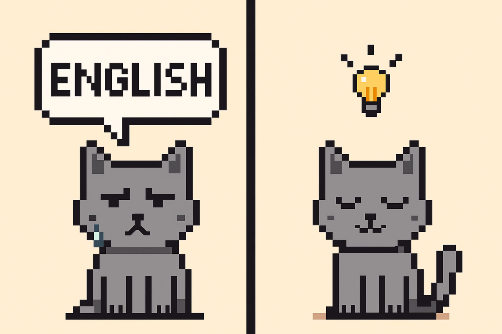

**Понимание начинается с вопроса**

Предыдущий пост был о том, что некоторые слова в английском могут выступать то как имена собственные, то как нарицательные. Причём проявляется это в ситуациях, к которым мы не привыкли в русском языке.

Перечитывая пост, я начал беспокоиться: всё ли я объяснил корректно, учёл ли все нюансы? Но потом понял — не стоит зацикливаться на том, чтобы объяснить всё идеально. Ведь цель этого блога не в том, чтобы заменить учебник или стать справочником.

Моя цель — делиться тем, что вызывает отклик, помогает увидеть логику языка и почувствовать удовольствие от понимания. Иногда это происходит через эмоции — даже через раздражение, когда что-то не получается. Но стоит разобраться, и раздражение превращается в ясность.

А ведь именно **вопрос** часто становится началом понимания.  
Когда мы пытаемся сформулировать, что именно непонятно, мы уже делаем шаг к ответу.  
Иногда вопрос рождается в разговоре с учителем, иногда — при чтении статьи или поиске в интернете.  
Главное — **не бояться спрашивать и искать**.

Если хотя бы нескольким людям мой блог помог это почувствовать — значит, мои усилия не пропали зря.