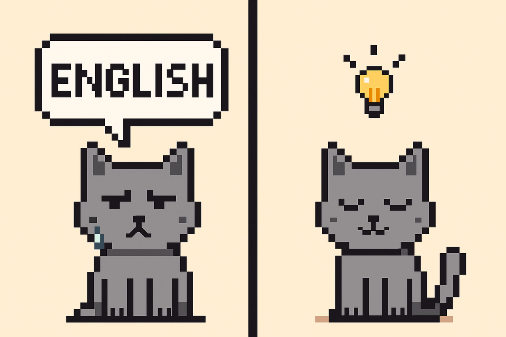

**О блоге, любопытстве и вопросах**

Иногда, перечитывая свои посты, переживаю: всё ли я объяснил корректно, учёл все нюансы?  
Но затем понимаю — не стоит стремиться к идеальности. Этот блог не заменяет учебник и не претендует на роль справочника.

Моя цель — делиться тем, что вызывает отклик, помогает заметить логику языка и испытать радость от понимания.  
Иногда понимание приходит через эмоции — даже через раздражение, когда что-то не удаётся. Но если разобраться, раздражение превращается в ясность.

Всё начинается с любопытства и вопроса. Вопрос часто становится первым шагом к пониманию.  
Когда мы пытаемся сформулировать, что именно непонятно, мы уже приближаемся к ответу.  
Вопрос может возникнуть в разговоре с учителем, при чтении статьи, учебника — или спонтанно.  
Главное — не бояться спрашивать и искать.

Если хотя бы несколько человек почувствуют то же самое благодаря моему блогу — значит, мои усилия того стоили.